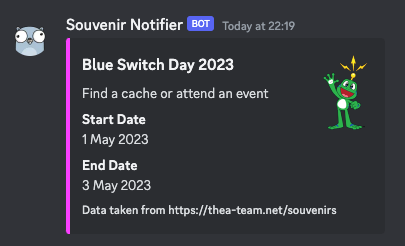

# gc-souvenir-notifier
A scheduled cloudflare worker for sending (Discord) webhook alerts for upcoming Geocaching souvenirs.  
  
Data is scraped from https://thea-team.net/souvenirs/date-based.  
By default, the worker runs 6 AM (utc) each day, and send a notification for each time-based souvenir starting that day.

## Setup
Set the environment variable `NOTIFIED_WEBHOOKS` to a list of webhook targets seperated by spaces.

e.g. `NOTIFIED_WEBHOOKS="https://discord.com/api/webhooks/.../..."`  
To set the environment variable for a deployed Worker, use the Cloudflare Dashboard, navigate to the settings tab of the published worker and create an according environment variable.

### Dev
Run the project locally using `yarn start --local --test-scheduled --var NOTIFIED_WEBHOOKS:https://discord.com/api/webhooks/.../...`  
Now you can manually trigger the worker by sending a HTTP GET Request to `http://localhost:8787/__scheduled`

## License
Geocaching and Signal the Frog are trademarks of Groundspeak. This project is not supported, endorsed, or in any other relation with Groundspeak Inc. It's a fan project.

This work is licensed under the [MIT License](https://opensource.org/license/mit/).  
Full License Text: [LICENSE.md](./LICENSE.md)
